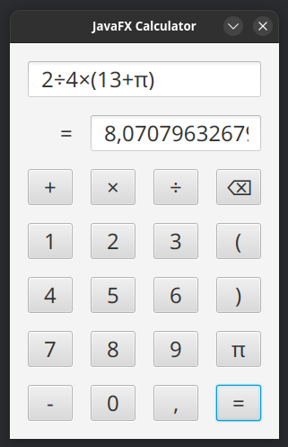

JavaFX Calculator
=================

This Project aims to create a simple yet working graphical calculator using JavaFx.

Dependencies
------------

- JDK 23

Build
-----

**Build:**
```bash
./gradlew build
```

**Run:**
```bash
./gradlew run
```

**Test:**
```bash
./gradlew test
```

Screenshot
----------


